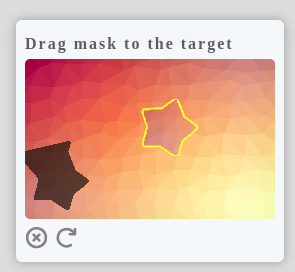

# Drag-Verify

Drag-and-drop graphics verification, easy to use. [中文](./README.md)

## run the example

1. Switch to this directory
2. `composer install`
3. `php -S 127.0.0.1:8087`
4. Browser access `http://127.0.0.1:8087`

## practice

Reference `index.php` `index.html` \
Copy `dragCaptcha.css` `dragCaptcha.js` to your own project application

## logic

## api

- php Drag
  - `generate()` generates rendering data `dst, front`
  - `verify()` to verify matching results

- js Drag
  - `matchFunc()` implements user drag to trigger matching
  - `render()` renders the drag-and-drop interface
  - `matchSuccess()` sets the match success style
  - `matchFail()` sets the match failure style
  - `destroy()` destroys the drag-and-drop interface
