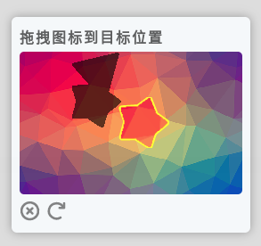
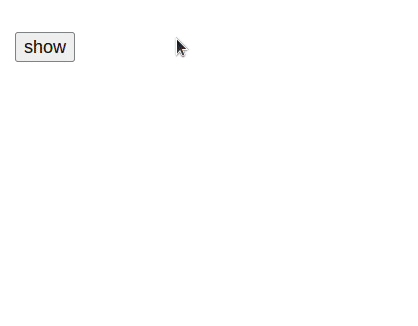

# Drag-Captcha

Drag-and-drop graphics verification, easy to use. [中文](./README.md)\
`composer require rlofls/drag-captcha`


- [features](#features)
  - [custom background](#custom-bg)
  - [Enable Interference Confuse](#confuse)
- [run example](#run-demo)
- [practice](#practice)
- [api](#api)
- [logic](#logic)

## <a id="features">features</a>

### <a id="custom-bg">custom background</a>

  First set the value of the `Resources::$customBg` array, which must be a **png** image, which stores the image path. eg:

  ```php
  //Set custom background
  Resources::$customBg = [
    __DIR__ . '/customBg/1.png',
    __DIR__ . '/customBg/2.png',
    __DIR__ . '/customBg/3.png',
    //...
  ];
  ```

### <a id="confuse">Enable Interference Confuse</a>

  It can make the target less obvious, and the target will be expanded/cut randomly. When calling the `generate()` method, you can pass in the `true` value. eg: `$drag->generate(true);`

- expand:

  
- cut

  
## <a id="run-demo">run the example</a>

1. Switch to this directory
2. `composer install`
3. `php -S 127.0.0.1:8087`
4. Browser access `http://127.0.0.1:8087`



## <a id="practice">practice</a>

Reference `index.php` `index.html` \
Copy `dragCaptcha.css` `dragCaptcha.js` to your own project application

## <a id="api">api</a>

- php Drag
  - `generate()` generates rendering data `dst, front`
  - `verify()` to verify matching results

- js Drag
  - `matchFunc()` implements user drag to trigger matching
  - `render()` renders the drag-and-drop interface
  - `matchSuccess()` sets the match success style
  - `matchFail()` sets the match failure style
  - `destroy()` destroys the drag-and-drop interface

## <a id="logic">logic</a>


## todo

- Welcome to submit `issue`
