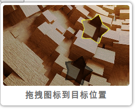
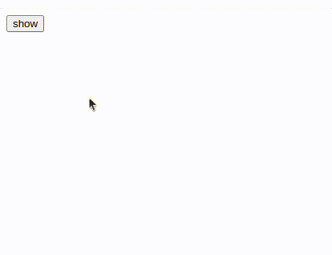

# Drag-Captcha

拖拽图形验证，简单易用。 [english](./README-en.md)

## 运行示例

1. 切换到此目录下
2. `composer install`
3. `php -S 127.0.0.1:8087`
4. 浏览器访问 `http://127.0.0.1:8087`

## 实践

参考 `index.php` `index.html`\
复制 `dragCaptcha.css` `dragCaptcha.js` 到自己项目应用

## 逻辑

## api

- php Drag
  - `generate()` 生成渲染数据 `dst, front`
  - `verify()` 验证匹配结果

- js Drag
  - `matchFunc()` 实现用户拖拽触发匹配
  - `render()` 渲染拖拽界面
  - `matchSuccess()` 设置 匹配成功 样式
  - `matchFail()` 设置 匹配失败 样式
  - `destroy()`  销毁拖拽界面
