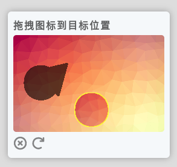

# Drag-Captcha

拖拽图形验证，简单易用。 [english](./README-en.md)\
`composer require rlofls/drag-captcha`



- [功能介绍](#features)
  - [自定义背景](#custom-bg)
  - [开启干扰混淆](#confuse)
- [运行示例](#run-demo)
- [实践](#practice)
- [api](#api)
- [逻辑](#logic)

## <a id="features">功能介绍</a>

### <a id="custom-bg">自定义背景</a>

  先设置 `Resources::$customBg` 数组值，一定要是 **png** 图片， 存放的是图片路径。 eg:

  ```php
  //设置自定义背景
  Resources::$customBg = [
    __DIR__ . '/customBg/1.png',
    __DIR__ . '/customBg/2.png',
    __DIR__ . '/customBg/3.png',
    //...
  ];
  ```

### <a id="confuse">添加干扰混淆</a>

  能够使目标不那么明显，会随机对目标进行扩展/剪切，在调用 `generate()` 方法时候， 传入`true` 值即可。 eg: `$drag->generate(true);`

- expand:

  
- cut

  
  
## <a id="run-demo">运行示例</a>

1. 切换到此目录下
2. `composer install`
3. `php -S 127.0.0.1:8087`
4. 浏览器访问 `http://127.0.0.1:8087`


## <a id="practice">实践</a>

参考 `index.php` `index.html`\
复制 `dragCaptcha.css` `dragCaptcha.js` 到自己项目应用

## <a id="api">api</a>

- php Drag
  - `generate()` 生成渲染数据 `dst, front`
  - `verify()` 验证匹配结果

- js Drag
  - `matchFunc()` 实现用户拖拽触发匹配
  - `render()` 渲染拖拽界面
  - `matchSuccess()` 设置 匹配成功 样式
  - `matchFail()` 设置 匹配失败 样式
  - `destroy()`  销毁拖拽界面
## <a id="logic">逻辑</a>


## todo

- 欢迎提交 `issuse`
